# Lavender Haven

For this last project I got inspired by the small business located in Dalmatia, Croatia. Hvar island is magical place well known for its lavander fields. I looked up their website and not much but the most important information was displayed for the users, so I thought of making the lavander as a hero of my last project and turning the idea into something a bit more advanced.

My website is a fully functioning B2C and B2B e-commerce application site and the main point is for the user to be able to make a payment for their purchases. But I really wanted to implement more to it than just a webstore, so the websites main features including the 'articles', 'checkout', 'cart', 'account' are the 'about', 'blog', 'contacts', 'testimonials' and the users have the option for a 'newsletter' subscription. The website provides the possibilty for the 'super user' to fully perform the CRUD actions on the 'articles' from both the admin panel and in the front-end and the users can do the same but with 'testimonials', but for UD in CRUD the testimonials must be first approved by the 'super user'.

The websites content in most parts is available for everyone. User can purchase articles as authenticated and as non-authenticated, but some actions as liking the blog post or leaving a testimonial requires a login.

I really wanted to show the skills I have learned during this course with CI. Programming its not easy and it will take me a loads of practice to get to the level I really want to be but I hope that one day I will be the senior and be the person to go to. 

The live deployed application can be found deployed on [Heroku]().

The link to my Github repository's [Github Repo](https://github.com/Balkaneros91/Lavender-Haven-PP5).

## CONTENTS

- [User Experience](#user-experience-ux)

  - [Agile](#agile)
  - [User Stories](#user-stories)
  - [Project stages](#project-stages)

- [Design](#design)

  - [Colour Scheme](#colour-scheme)
  - [Typography](#typography)
  - [Wireframes](#wireframes)

- [Features](#features)

  - [General Features on Each Page](#general-features-on-each-page)
  - [Future Implementations](#future-implementations)

- [Technologies Used](#technologies-used)

  - [Languages Used](#languages-used)
  - [Frameworks, Libraries & Programs Used](#frameworks-libraries--programs-used)

- [Deployment & Local Development](#deployment--local-development)

  - [Deployment](#deployment)
  - [ElephantSQL databse](#elephantsql-database)
  - [Cloudinary API](#cloudinary-api)
  - [Heroku deployment](#heroku-deployment)
  - [Local deployment](#local-deployment)
    - [Cloning](#cloning)
    - [Forking](#forking)

- [Testing](#testing)

  - [Responsiveness](#responsiveness)
  - [Manual testing](#manual-testing)
  - [Browser Compatibility](#browser-compatibility)
  - [Lighthouse](#lighthouse)
  - [W3C HTML Validator](#w3c-html-validator)
  - [JIGSAW W3C CSS Validator](#jigsaw-w3c-css-validator)
  - [JShint](#jshint)
  - [Code Institute Python Linter](#code-institute-python-linter)
  - [Chrome DevTools](#chrome-devTools)
  - [Known bugs](#known-bugs)
  - [Solved bugs](#solved-bugs)

- [Credits](#credits)
  - [Code Used](#code-used)
  - [Content](#content)
  - [Media](#media)
  - [Acknowledgments](#acknowledgments)

## Design

### Colour Scheme

Since my website is all about lavender and it's culture I wanted my page to reflect the calmness and tranquility of it. The color palett is colorful and playful and I really wanted to achieve the welcoming and relaxing invitation for the user to get their full attention so they can explore all the content Lavender Haven has to offer.

[Coolors.co](https://coolors.co/) was the website I've used to fetch the colour palette presented.

### Typography

I have picked Amethysta font because it perfectly suited the content of my website and I have used the same font throughout the whole webcontent.

## Wireframes

[Balsamiq](https://balsamiq.com/wireframes) is used for wireframe design.

### Lavender Haven's Home Page

Click here!

#### Mobile

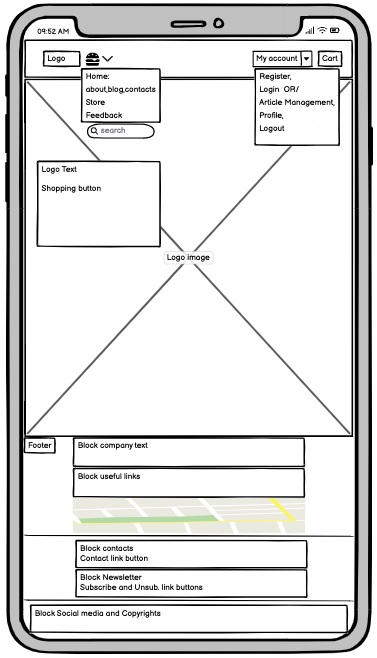

#### Desktop

### About Page

Click here!

#### Mobile

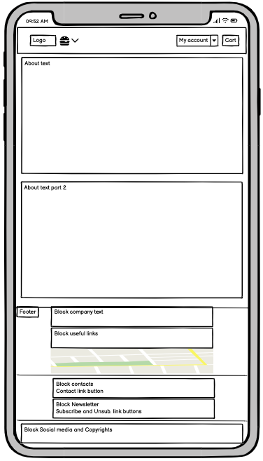

#### Desktop

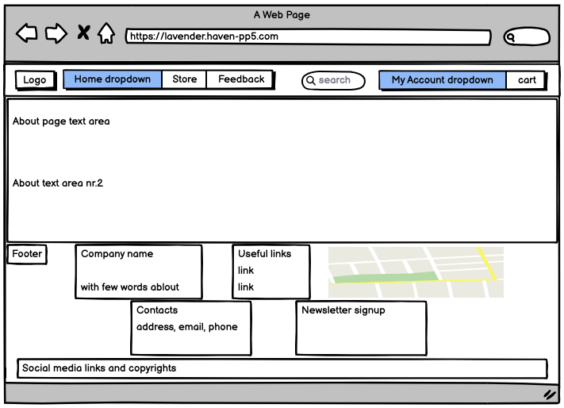

### Blog Page

Click here!

#### Mobile

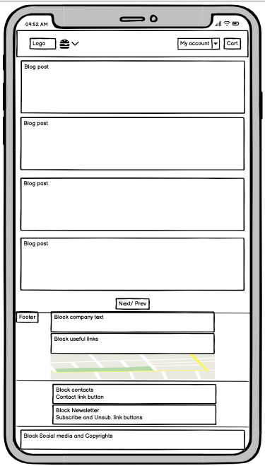
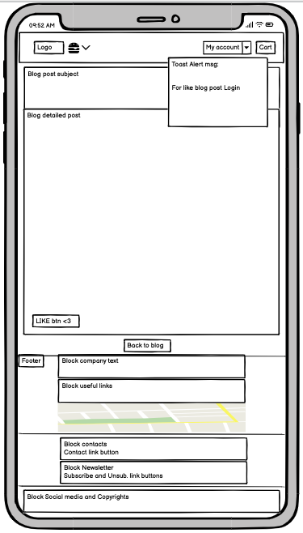

#### Desktop

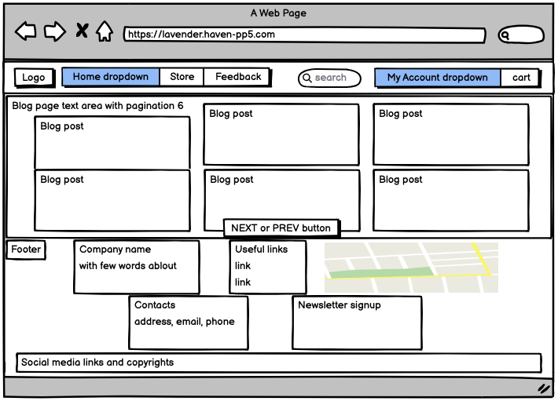

### Contacts page

Click here!

#### Mobile

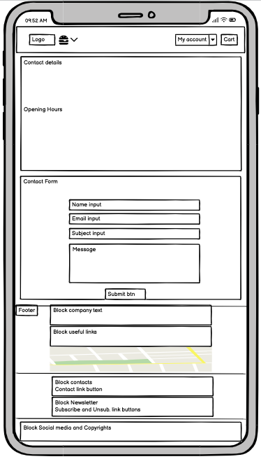

#### Desktop

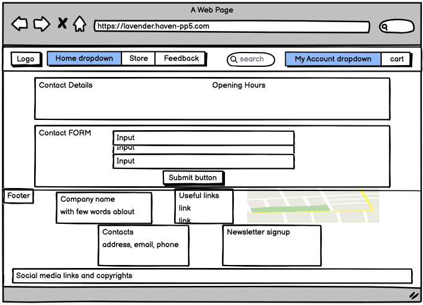

### Articles page

Click here!

#### Mobile

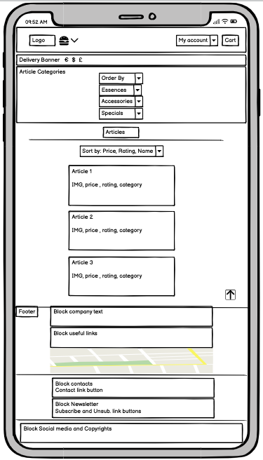
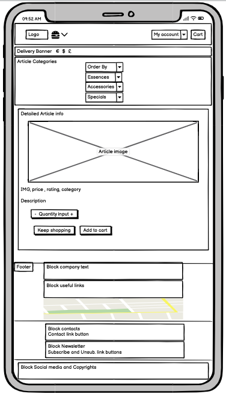
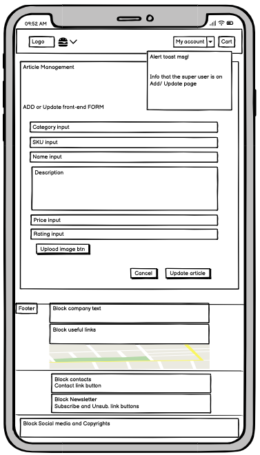
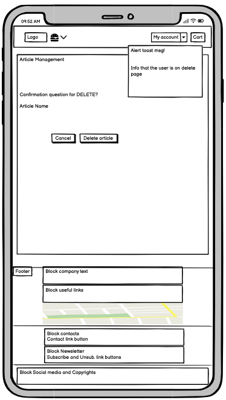

#### Desktop

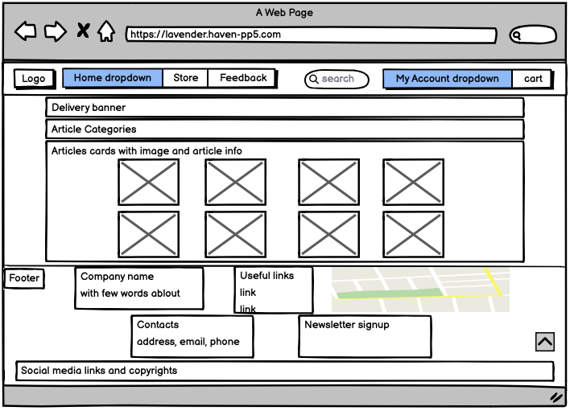
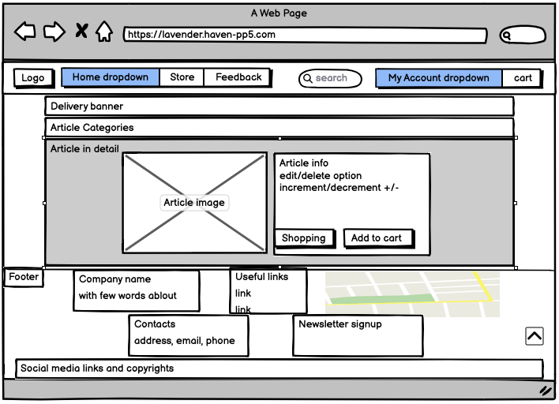
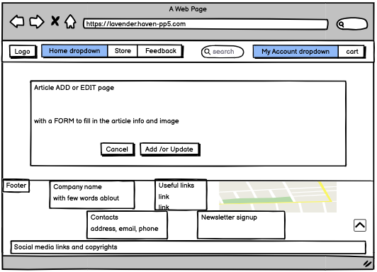
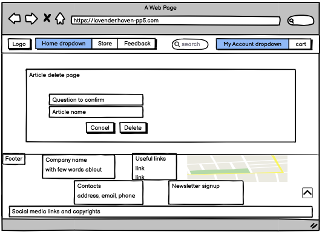

### Testimonials page

Click here!

#### Mobile

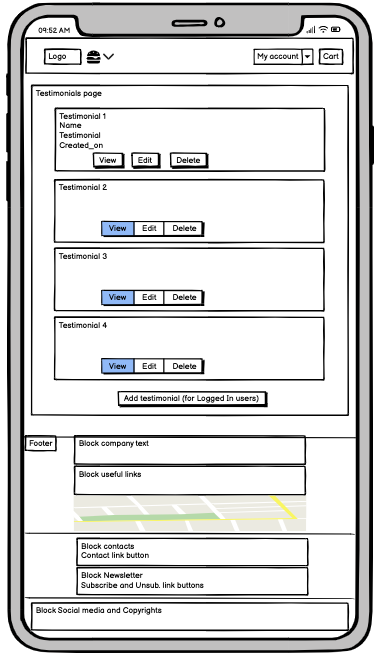
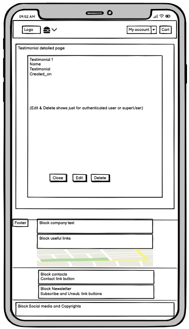
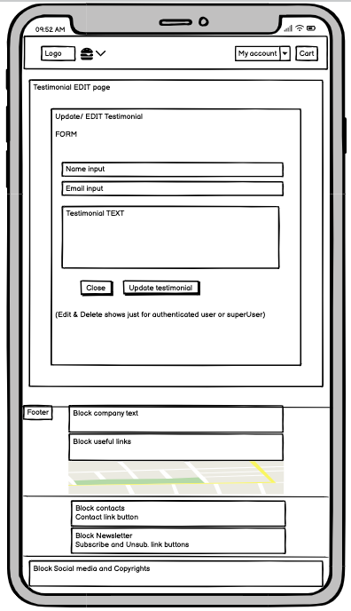
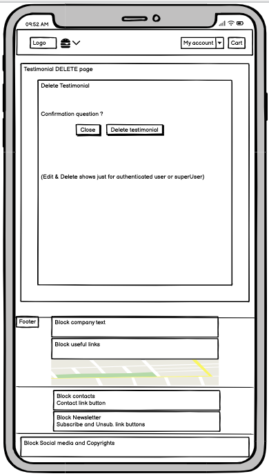

#### Desktop

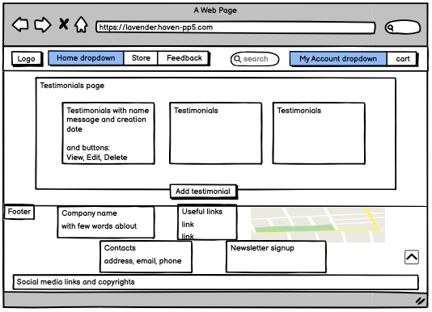
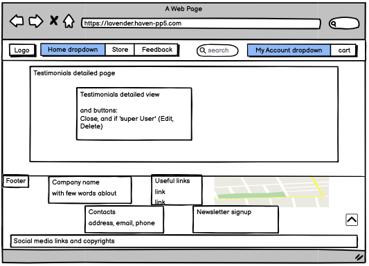
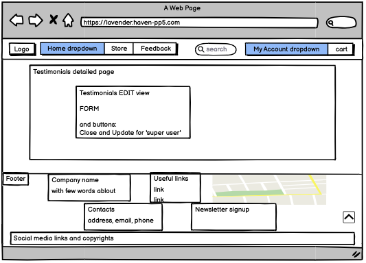

### SignUp, SignIn and SignOut pages

Click here!

#### Mobile

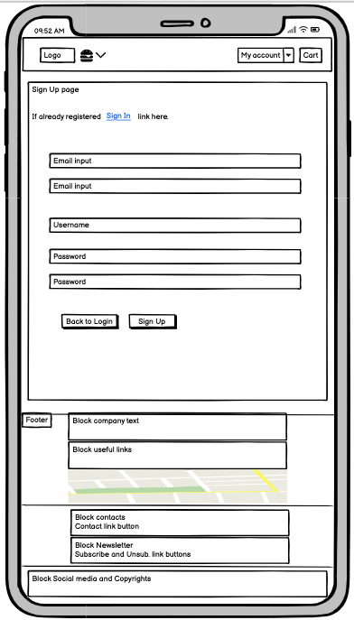
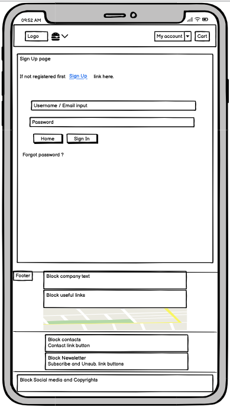
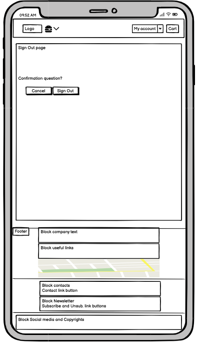

#### Desktop

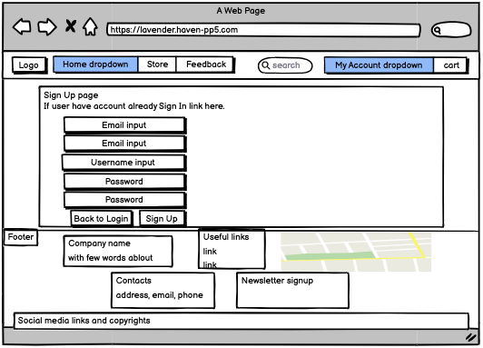
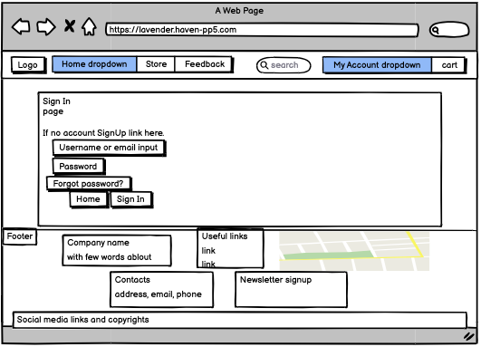
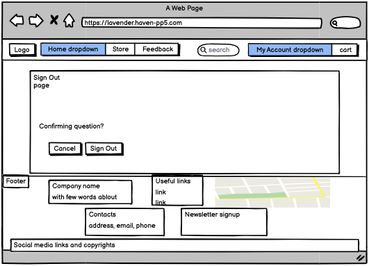

### Unsubscribe page

Click here!

#### Mobile

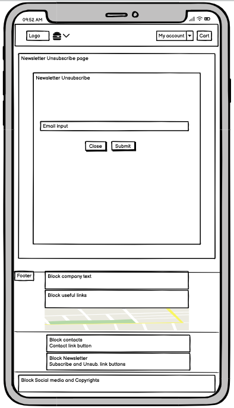

#### Desktop

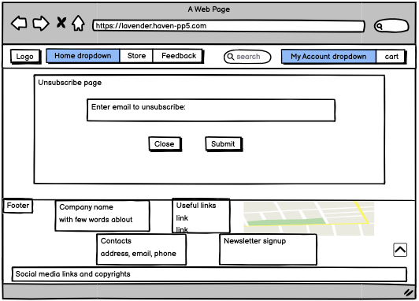

### Shopping cart page

Click here!

#### Mobile

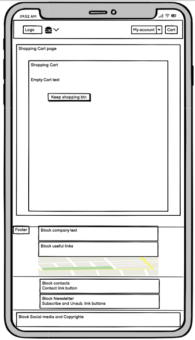

#### Desktop

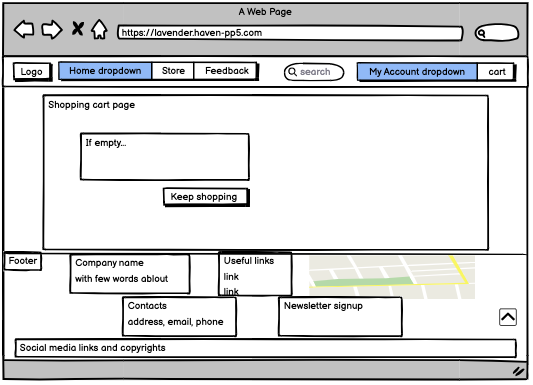
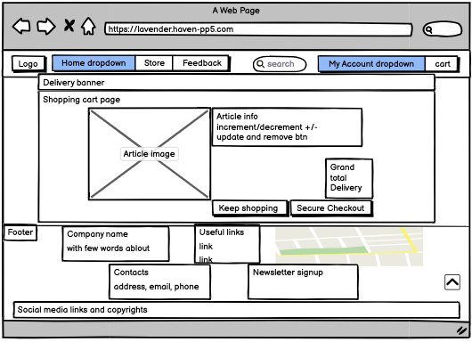

### Checkout and checkout success pages

Click here!

#### Mobile

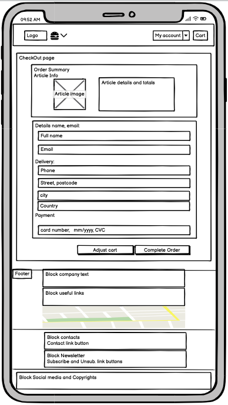
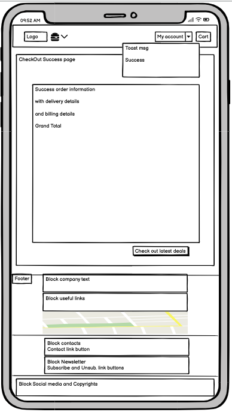

#### Desktop

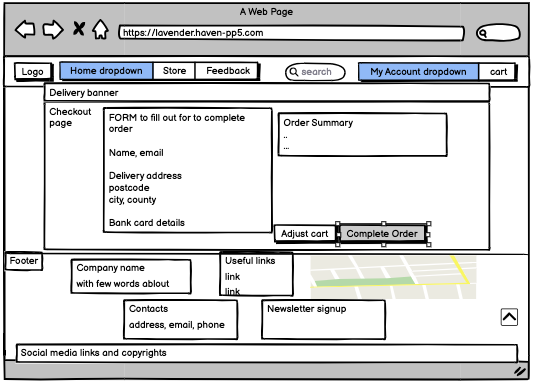
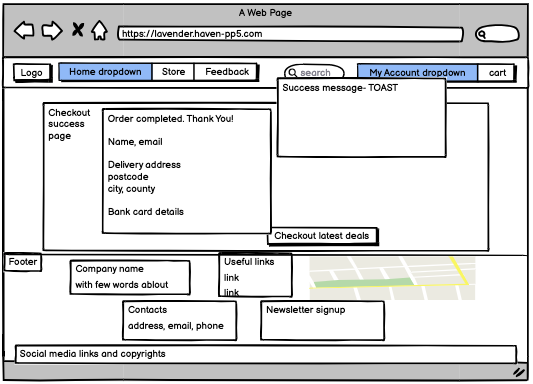

### Account and Order history Page

Click here!

#### Mobile

#### Desktop

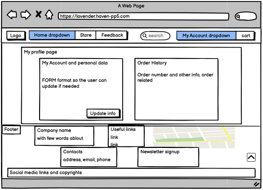

## Credits

Code Institue projects: 'Boutique Ado', 'I think therefore I blog' and assessment results for my PP4 has helped me a lot during the project planning for my websites design and improvments

Extra help I've used for this project, please see links below.

### Code Used

- [w3schools](https://www.w3schools.com/)
- [Stack Overflow](https://stackoverflow.com/)
- [CSS Media Queries](https://www.w3schools.com/css/css3_mediaqueries.asp)
- [Grid-View](https://www.w3schools.com/css/css_rwd_grid.asp)
- [emmet.io](https://docs.emmet.io/cheat-sheet/)

- [Start Bootstrap](https://startbootstrap.com/theme/clean-blog)
- [Django documentation](https://docs.djangoproject.com/en/3.2/)

### Content

- The code is insired by the Boutique Ado walkthrough which is reflecting in my project and for the other parts of my website the content is coded by me based on the inspiration I got after seeing the platform of a small Croatian business.

- For the deployment section I got expired by my colleague here at CI,Adam Gilroy.

### Media

- [Favicon](https://realfavicongenerator.net/) The favicon generator help me create my own favicon.  
  

All images are downloaded from internet and used only for purposes of this project.

### Acknowledgments

- I want to thank my mentor Antonio Rodriguez for all the patience, help and support.
- CI tutor support who help a few times during the process.
- Kudos to my beautiful and also patiente husband, Nedicto Entenza Gutierrez who help me with a material and descriptions 